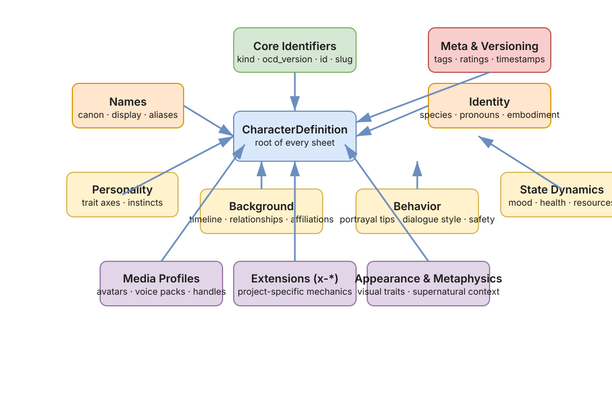
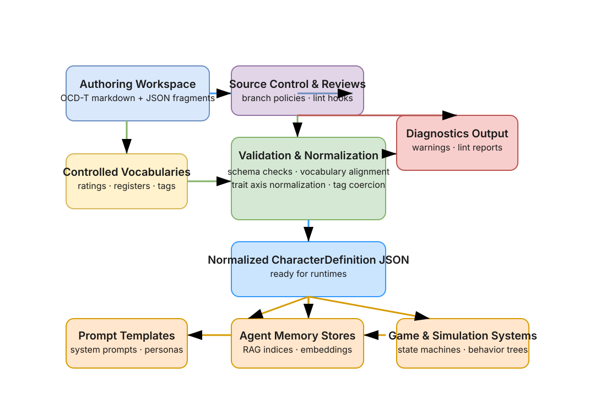

# Schema Overview

The `CharacterDefinition` schema (see `spec/core.schema.json`) organizes a character sheet into a predictable
set of root blocks. Validators expect the following core properties to exist in every document:

- `kind`, `ocs_version`, `id`, and `slug` identify the sheet and determine which validator profile to load.
- `names.canon` supplies the canonical label presented to players, while `names.display` and
  `names.aliases[]` let you localize or expose alternate identities.
- `identity` captures species, pronouns, and embodiment essentials that downstream systems turn into runtime
  descriptions.
- `meta.versioning` records ISO 8601 `created_at` and `last_modified` timestamps so the
  [validator diagnostics](../reference/diagnostics.md) can warn if stale revisions are deployed.

## Optional Blocks & Vocabularies

Each optional block hangs off the root and focuses on a specific responsibility:

- **Personality** stores the structured trait model and free-form instincts. Trait names should align with the
  [controlled vocabularies](../reference/vocabularies.md) that power analytics and filtering.
- **Background** holds timeline events, affiliations, and relationships that runtime systems surface in
  conversation. Validators raise `UNRESOLVED_REF` warnings when `relationships[].target_ref` values cannot be
  resolved (see [Python validator](../integration/python-validator.md) and
  [JS/TS validator](../integration/js-ts-validator.md)).
- **Behavior** configures portrayal tips, dialogue style (register, pacing, allowable registers from the
  controlled vocabulary), and safety directives that help runtime guardrails. Conflicts between behavior tags and
  meta ratings trigger `RATING_CONFLICT` warnings from the validators.
- **State Dynamics** tracks mutable stats—mood, health, resources—that may be patched at runtime without
  mutating identity.
- **Extras / Extensions** provide `x-*` namespaces for project-specific mechanics while keeping the portable core
  clean.

When authoring, prefer normalized tokens (lowercase, deduped) so validator normalization does not introduce noisy
diffs. The validators automatically normalize bipolar trait axis separators to `↔` and align register names with the
documented vocabularies.

## Authoring to Runtime Flow

1. **Authoring.** Narrative teams author OCD-T files that mix markdown context with structured JSON fragments.
2. **Controlled vocabularies.** During validation the tooling looks up register, rating, and tag terms in the
   [controlled vocabularies reference](../reference/vocabularies.md) to ensure canonical spellings.
3. **Validators.** Both the [Python](../integration/python-validator.md) and
   [JS/TS](../integration/js-ts-validator.md) validators parse, normalize, and emit diagnostics
   ([diagnostics list](../reference/diagnostics.md)). They coerce tags, normalize trait axes, and surface conflicts.
4. **Runtime JSON.** The resulting `CharacterDefinition` JSON feeds prompt templates, agent memory stores, and game
   state machines.

## Case Studies

### Sherlock Holmes (Investigative NPC)

- **Identity & Meta.** `kind: humanoid`, `species: human`, `meta.tags: [detective, victorian, consulting]`. Ratings
  stay at `violence: moderate`, keeping interactions consistent with the
  [appropriateness vocabulary](../reference/vocabularies.md).
- **Background.** `relationships[]` reference Dr. John Watson via `target_ref: john-watson`, demonstrating
  cross-character linking. Validators confirm the reference resolves and raise `UNRESOLVED_REF` if Watson is absent.
- **Behavior.** Dialogue style set to `register: formal`, `pace: measured` (values sourced from the controlled
  register vocabulary) and portrayal tips nudge deductive exposition. Deploying this sheet in an assistant ensures
  prompts pull the same canonical persona each session.

### Shuri (Tech-Forward Hero)

- **Identity & Names.** Canon name `Shuri`, with `aliases: [Princess Shuri, Black Panther]` so front-ends can display
  culturally relevant titles.
- **Personality.** Traits include `serious↔playful: polarity -0.2` and `logic↔intuition: polarity 0.8`, normalized by
  validators to use the `↔` separator described in the [trait model](trait-model.md).
- **State Dynamics.** Tracks lab focus (`focus: vibranium-research`) and stress meters that live-update during play.
- **Meta.** Content rating set to `violence: fantasy` in line with the vocabulary, enabling distribution filters to
  gate the character for younger audiences.
